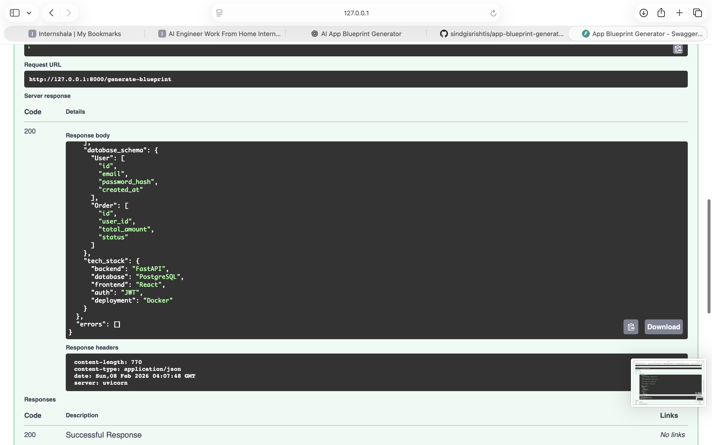
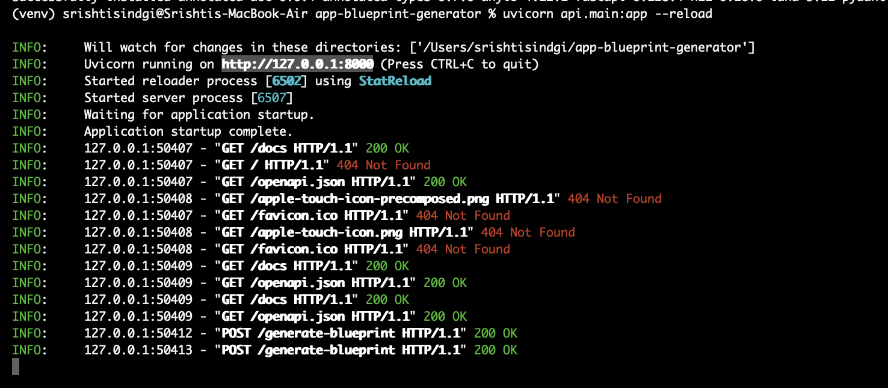

# 🧠 Natural Language → App Blueprint Generator

An AI-inspired platform that converts natural language app ideas into structured
UI screens, backend APIs, database schemas, and tech stack recommendations.

---

## 🚀 What This Project Does

**Input (Natural Language):**
> "I want a food delivery app with login, cart and payments"

**Output (Structured Blueprint):**
- UI Screens (JSON)
- Backend API endpoints
- Database schema
- Recommended tech stack
- Validation & consistency checks

---

## 📸 Demo

### Swagger API – App Blueprint Generation


### FastAPI Server Running


## 🏗️ Architecture Overview

User Input
↓
NLP Parser
↓
Blueprint Generator
↓
Validation Engine
↓
FastAPI Endpoint

---

## 🛠️ Tech Stack

- Python 3.11
- FastAPI
- JSON
- Rule-based NLP
- Modular validation engine

---

## 📂 Project Structure

app-blueprint-generator/
├── generator/ # NLP & blueprint generation
├── validator/ # Schema & logic validation
├── api/ # FastAPI service
├── tests/ # Basic tests
├── examples/ # Sample inputs
└── README.md

---

## ▶️ How to Run

```bash
python3 -m venv venv
source venv/bin/activate
pip install -r requirements.txt
uvicorn api.main:app --reload
Visit:
http://127.0.0.1:8000/docs
🎯 Why This Project Matters
This project simulates real-world AI platform engineering by:
Converting unstructured input into structured system design
Validating AI outputs before execution
Exposing AI logic via production-style APIs

---

## Author
**Srishti Sindgi**  
GitHub: https://github.com/sindgisrishtis